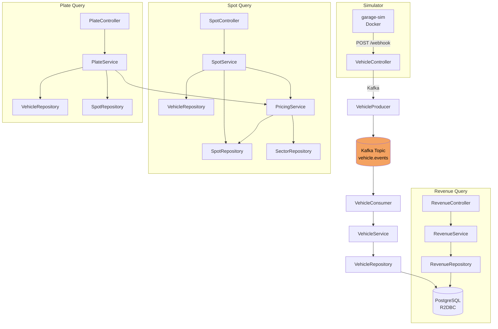

# 🚗 **Auto‑Park System**

> **Smart, event‑driven parking‑lot management built with Reactive Spring Boot, Kafka & gRPC**


---

## 📚 Table of Contents

1. [Project Overview](#project-overview)
2. [Features](#features)
3. [Architecture](#architecture)
4. [Tech Stack](#tech-stack)
5. [Dockerized Environment](#dockerized-environment)
6. [Configuration](#configuration)
7. [Database Schema](#database-schema)
8. [API Reference](#api-reference)
9. [Getting Started](#getting-started)
10. [Running Tests](#running-tests)
11. [Contributing](#contributing)
12. [License](#license)

---

## Project Overview

**Auto‑Park System** is a *reactive* backend that ingests real‑time parking‑lot events and exposes well‑documented APIs for querying vehicle status, spot occupancy and daily revenue.  It was created as an assessment for Estapar but is designed to scale in production.

* 🔄 **Event‑driven** – ENTRY, PARKED & EXIT events flow through **Kafka** (or gRPC) before being persisted.
* ⚡ **Reactive WebFlux** – non‑blocking endpoints keep threads free & happy.
* 💸 **Dynamic pricing** – fares adjust automatically based on lot occupancy.
* 🗄️ **R2DBC + PostgreSQL** – fully asynchronous persistence with zero JDBC blocking.

---

## Features

| Category          | Capability                                                                                      |
| ----------------- | ----------------------------------------------------------------------------------------------- |
| **Inventory**     | Real‑time tracking of free / occupied spots per sector                                          |
| **Vehicle Flow**  | `/webhook` endpoint accepts events, publishes them to Kafka                                     |
| **Queries**       | REST endpoints for plate status, spot status & revenue                                          |
| **Pricing Rules** | –10 % (<25 % full) • 0 % (25–49 %) • +10 % (50–74 %) • +25 % (75–99 %) • Block entries at 100 % |
| **Docs**          | Swagger UI (OpenAPI 3) at `/swagger-ui.html`                                                    |
| **Observability** | Structured JSON logs, tracing hooks ready for Micrometer                                        |

---

## Architecture



## Tech Stack

| Layer       | Technology                                      | Why                                                    |
| ----------- | ----------------------------------------------- | ------------------------------------------------------ |
| Runtime     | **Java 22**, **Spring Boot 3.4**                | Modern language features & virtual threads (if needed) |
| Web         | **Spring WebFlux**                              | Reactive, back‑pressure aware                          |
| Persistence | **Spring Data R2DBC**, **PostgreSQL 15**        | Non‑blocking SQL driver                                |
| Messaging   | **Apache Kafka 3.5**, **Spring Kafka**          | High‑throughput event stream                           |
| RPC         | **gRPC 1.60**, **Protobuf 3.24**                | Low‑latency intra‑service comms                        |
| Docs        | **springdoc‑openapi**                           | Live Swagger UI                                        |
| Tests       | **JUnit 5**, **Testcontainers**, **Awaitility** | Fast, isolated CI                                      |
| DevOps      | **Docker Compose**, GitHub Actions              | 1‑command bootstrap & CI/CD                            |

---

## Dockerized Environment

Spin up **PostgreSQL, pgAdmin, Zookeeper & Kafka** with a single command.

```yaml
version: "3.8"
services:
  postgres:
    image: postgres:latest
    environment:
      POSTGRES_USER: admin
      POSTGRES_PASSWORD: admin
      POSTGRES_DB: auto-park-system
    ports: ["5432:5432"]
    volumes:
      - ./volumes/postgres/pgdata:/var/lib/postgresql/data

  pgadmin:
    image: dpage/pgadmin4:latest
    environment:
      PGADMIN_DEFAULT_EMAIL: you@example.com
      PGADMIN_DEFAULT_PASSWORD: admin
    ports: ["5050:80"]
    depends_on: [postgres]

  zookeeper:
    image: bitnami/zookeeper:latest
    environment: ["ALLOW_ANONYMOUS_LOGIN=yes"]
    ports: ["2181:2181"]

  kafka:
    image: bitnami/kafka:3.5.1-debian-11-r58
    environment:
      - KAFKA_CFG_ZOOKEEPER_CONNECT=zookeeper:2181
      - KAFKA_CFG_LISTENERS=PLAINTEXT://0.0.0.0:9092
      - KAFKA_CFG_ADVERTISED_LISTENERS=PLAINTEXT://localhost:9092
      - ALLOW_PLAINTEXT_LISTENER=yes
    ports: ["9092:9092"]
    volumes:
      - ./volumes/kafka:/bitnami/kafka
    depends_on: [zookeeper]
```

> **Access pgAdmin:** [http://localhost:5050](http://localhost:5050) — log in with the credentials above.

---

## Configuration

Default `application.yml` values (override with env vars or `SPRING_APPLICATION_JSON`):

```yaml
server:
  port: 3003

grpc:
  server:
    port: 9090

spring:
  r2dbc:
    url: r2dbc:postgresql://localhost:5432/auto-park-system
    username: admin
    password: admin

  sql:
    init:
      mode: always
      schema-locations: classpath:schema.sql
      data-locations: classpath:data.sql

  kafka:
    bootstrap-servers: localhost:9092
    producer:
      key-serializer: org.apache.kafka.common.serialization.StringSerializer
      value-serializer: org.apache.kafka.common.serialization.ByteArraySerializer
    consumer:
      group-id: auto-park-group
      auto-offset-reset: earliest
      key-deserializer: org.apache.kafka.common.serialization.StringDeserializer
      value-deserializer: org.apache.kafka.common.serialization.ByteArrayDeserializer

logging.level.org.springframework.r2dbc: DEBUG
```

---

## Database Schema

```sql
CREATE TABLE revenue (
    id BIGSERIAL PRIMARY KEY,
    sector VARCHAR NOT NULL,
    date   DATE NOT NULL,
    amount DOUBLE PRECISION NOT NULL,
    currency VARCHAR NOT NULL,
    timestamp TIMESTAMPTZ NOT NULL
);

CREATE TABLE sector (
    name VARCHAR PRIMARY KEY,
    base_price DOUBLE PRECISION NOT NULL,
    max_capacity INTEGER NOT NULL,
    open_hour TIME NOT NULL,
    close_hour TIME NOT NULL,
    duration_limit_minutes INTEGER NOT NULL
);

CREATE TABLE spot (
    id BIGSERIAL PRIMARY KEY,
    sector VARCHAR NOT NULL REFERENCES sector(name),
    lat DOUBLE PRECISION NOT NULL,
    lng DOUBLE PRECISION NOT NULL,
    occupied BOOLEAN NOT NULL DEFAULT FALSE,
    license_plate VARCHAR
);

CREATE TABLE vehicle (
    id BIGSERIAL PRIMARY KEY,
    license_plate VARCHAR NOT NULL,
    event_type VARCHAR NOT NULL,
    timestamp TIMESTAMPTZ NOT NULL,
    lat DOUBLE PRECISION,
    lng DOUBLE PRECISION
);
```

Key points:

* **`sector`** drives pricing rules & capacity limits.
* **`spot.occupied`** toggles in real time as PARKED/EXIT events arrive.
* **`vehicle`** stores the raw event log for audit & replay.

---

## API Reference

```http
POST /webhook                # ingest ENTRY / PARKED / EXIT
POST /plate-status           # query by license plate
POST /spot-status            # query by GPS location
GET  /revenue?date=&sector=  # daily revenue
```

Detailed Swagger docs live at **`/swagger-ui.html`** once the app is running.

---

## Getting Started

### Prerequisites

* **JDK 22** & Maven 3.9+
* **Docker** & **Docker Compose**

### Run Everything

```bash
# 1️⃣  Boot Postgres + Kafka + pgAdmin
docker compose up -d

# 2️⃣  (Optional) start garage simulator

```
